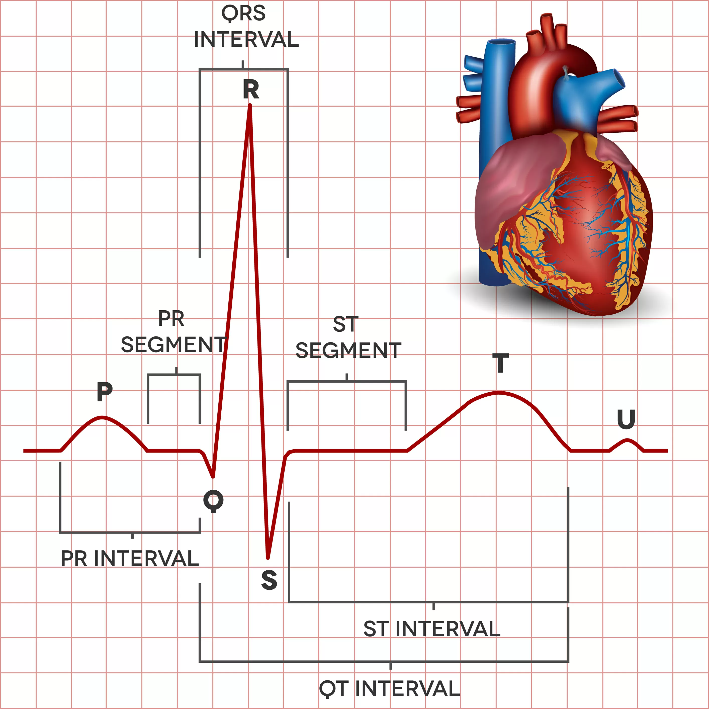
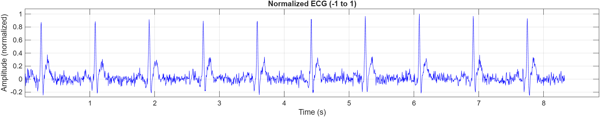
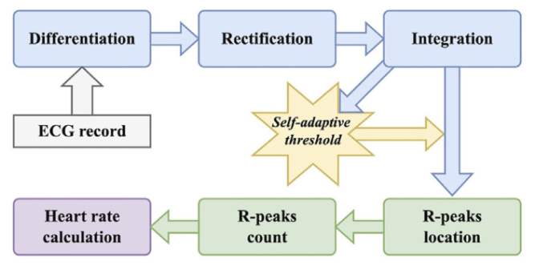
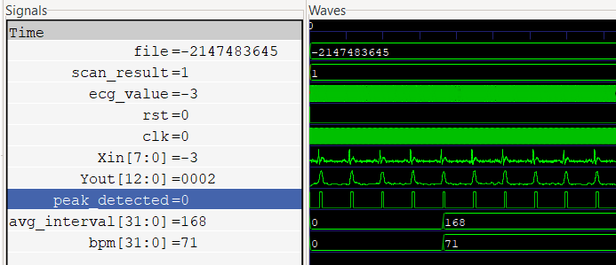

# Digital Heart Rate Estimator Using ECG Signal Processing

**Duration:** Mar 2025 - Apr 2025  
**Tools & Technologies:** Verilog, RTL Design, Digital Signal Processing (DSP), Icarus Verilog, GTKWave

## Project Overview

The Electrocardiogram (ECG) is a non-invasive signal that represents the **electrical activity of the heart**. Key features of an ECG include **P, QRS, and T waves**, with the **QRS complex** being the most prominent for heart rate estimation. ECG signals are often noisy and vary in amplitude across individuals, requiring robust processing techniques.  

This project implements a **real-time heart rate estimator** in **Verilog HDL** that processes ECG signals through a digital pipeline: **preprocessing** (derivative filtering, rectification, integration), **self-adaptive peak detection**, **RR interval averaging**, and **BPM calculation**. The design outputs accurate heart rate measurements robust to noise and signal variations and is verified using **Xilinx Vivado**.

## Heart Rate Pipeline

The heart rate estimation system is designed as a **real-time, fully digital signal processing pipeline** for analyzing ECG signals and extracting accurate heart rate information. The architecture is modular, allowing independent verification and enhancement of each stage, while maintaining a continuous data flow suitable for **FPGA implementation**. The system is capable of handling noisy and variable ECG signals, ensuring reliable operation in real-world biomedical applications.

### 1. Preprocessing Stage

The preprocessing stage is responsible for **enhancing the QRS complexes** and suppressing noise in the raw ECG signal. It performs several critical operations:

* **Derivative Filtering:** Highlights rapid changes in the signal, primarily the steep slopes of the QRS complex. This allows the system to emphasize the most important features for heart rate estimation.
* **Rectification:** Converts all signal values to positive, removing negative excursions. This simplifies subsequent peak detection and ensures that the integration stage can operate effectively.
* **Moving-Window Integration:** Smooths the signal over a short temporal window, reducing high-frequency noise and enhancing the distinction between peaks and baseline fluctuations

* **Activity detection & mode control:** A lightweight monitor measures sample differences and, using FLAT_THRESH and FLAT_CYCLES, drives an ACTIVE/SLEEP FSM to disable processing during flat ECG periods while remaining responsive to new activity.

* **True clock gating for low power:** The FSM controls a gated clock so the entire heavy preprocessing pipeline (derivative, rectification, integration) is clocked only when needed, eliminating unnecessary toggling and reducing dynamic power consumption. 

### 2. Adaptive Peak Detection

After preprocessing, the system detects R-peaks using a **self-adaptive thresholding algorithm**. This stage incorporates several design considerations:

* **Dynamic Thresholding:** The threshold adjusts automatically according to the maximum amplitude of the recent signal history, allowing the detector to handle varying signal amplitudes across different patients or measurement conditions.
* **Peak Validation:** Only peaks exceeding the adaptive threshold are considered valid, reducing false detections caused by noise or motion artifacts.
* **Robustness to Signal Variability:** By continuously updating the threshold, the system maintains accurate detection in the presence of amplitude drift, baseline wander, or transient spikes.
* **Dynamic clock scaling (FAST/SLOW modes):** An inactivity counter (idle_cnt) and FSM switch processing to SLOW mode after IDLE_SAMPLES without peaks, reducing operation rate by using a divided clock (clk_slow), and return to FAST mode when activity resumes.

* **Clock-scaled heavy logic:** The most power-hungry blocks (buffer max search and adaptive threshold update) run on the scaled clock (clk_scaled), so their switching activity is reduced during low heart-rate or idle periods while lightweight monitoring continues at the base clock.

This adaptive approach ensures that the heart rate calculation remains accurate in real-time operation, without manual tuning or offline calibration.

### 3. RR Interval Calculation

Once R-peaks are detected, the pipeline calculates the **interval between consecutive peaks (RR interval)**. This stage enhances reliability through several features:

* **Interval Averaging:** Multiple RR intervals are averaged over a configurable number of peaks. This reduces the impact of occasional irregular beats or misdetected peaks, providing a smoother, more physiologically meaningful heart rate estimate.
* **Edge Detection:** Rising edges of the peak detection signal are tracked to accurately identify the timing of heartbeats.
* **Outlier Rejection:** By using averaging and counting only valid intervals, the system reduces sensitivity to noise-induced false peaks.
* **Clock gating:**  The entire RR-interval logic (timebase counter, edge detector, accumulation, averaging) runs on a gated clock clk_rr that is enabled only while done = 0. Once the required number of RR intervals is averaged, done is set to 1, clk_rr is shut off, and all internal registers stop toggling, eliminating further dynamic power.

* **One-shot computation & localized activity:** The block performs a single averaging operation over NUM_PEAKS intervals, then freezes; no continuous processing or unnecessary re-calculation. Even the edge detection on peak_detected and the timebase counter only operate while measurement is active, keeping switching activity tightly bounded to the measurement window.
The RR interval stage provides a **robust temporal measurement**, forming the foundation for accurate heart rate computation.

### 4. BPM Calculation

The final stage converts the **average RR interval into beats per minute (BPM)**:

* **Direct Conversion:** The BPM is computed using the known system clock frequency and the measured RR interval.
* **Real-Time Output:** The system continuously updates the BPM, enabling instantaneous heart rate monitoring.
* **Hardware Efficiency:** The calculation is lightweight, requiring only basic arithmetic, making it suitable for digital hardware implementation.

This stage ensures the heart rate is presented in a clinically meaningful unit, ready for display or further processing.

### Key Features of the Architecture

* **Modular Design:** Each stage operates independently, simplifying testing, debugging, and potential hardware reuse.
* **Real-Time Operation:** The pipeline continuously processes incoming ECG signals, providing immediate heart rate outputs.
* **Noise Resilience:** Preprocessing and adaptive detection stages ensure accurate operation under high-noise conditions.
* **Scalable Averaging:** Configurable RR interval averaging improves stability and reduces the influence of transient errors.
* **Hardware Optimized:** Efficient use of registers, adders, and shift operations ensures the design is suitable for FPGA or ASIC implementation.

### Output Waveforms

### Conclusion

The Digital Heart Rate Estimator demonstrates a fully digital, real-time ECG signal processing pipeline capable of accurately detecting heartbeats and computing BPM. By integrating preprocessing, adaptive peak detection, RR interval calculation, and BPM computation, the system achieves robust performance even in the presence of noise and varying signal amplitudes.

## Contributors

- **Boddu Ajay**  
- **Ganderla Chaithanya** 

